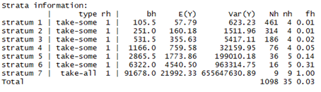

##### Realizado por:

- **Nestor Jardany Serrano Rojas**, [GitHub](https://github.com/jardanys/SmallAreaEstimation_SABER11) 
- **Camilo Alejandro Aguilar Laverde**, [GitHub](https://github.com/CamiloAguilar/SmallAreaEstimation_SABER11)
- **Alvaro Enrique Villaba Mendez**, [GitHub](https://github.com/jardanys/SmallAreaEstimation_SABER11) 

<br/>

<div class=text-justify>
Todo el contenido (datos, scripts, resultados etc) de esta presentación puede detallarse en el repositorio disponible en el siguiente [enlace](https://github.com/jardanys/SmallAreaEstimation_SABER11). Los datos utilizados están disponibles en formato RDS.
</div>

```{r setup, include=FALSE}
knitr::opts_chunk$set(message = FALSE, warning = FALSE)
info.date<-format(Sys.time(), "%Y-%m")
fileConn<-file("footer2.html")
msj<-paste("<br/><p>", info.date, "Universidad Santo Tomas</p>")
writeLines(c(msj,"<p>Copyright &copy; All rights reserved.</p>"),fileConn)
close(fileConn)
```

```{r libraries, include=FALSE}
library(survey)
library(sae)
library(TeachingSampling)
library(dplyr)
library(kableExtra)
library(knitr)
library(GGally)
options(scipen = 999)
options(survey.lonely.psu="adjust")
```

<br/><br/>

## Introducción 

<br/>

<div class=text-justify>
En el presente Trabajo se hace una breve revisión de los estimadores diseñados para el estudio de áreas pequeñas. En la práctica, un buen tamaño de muestra es suficiente para obtener una buena precisión para las estimaciones del promedio y total de la población. Sin embargo, como es el caso, cuando se requieren estimaciones para algunos dominios de interés nos encontramos con muy pocas o ningunas observaciones, de manera que se dificulta obtener precisiones aceptables utilizando los estimadores usuales, por lo que para el desarrollo del documento se hizo uso de estrategias de estimación de dominios que involucran el diseño muestral y los diferentes métodos de basados en modelos. 

En el estudio de los dominios, existen diferentes técnicas de estimación, los estimadores más conocidos desde la perspectiva basada en el diseño son los estimadores directos, de regresión y sintéticos, mientras que por otro lado, también se encuentran los estimadores basados en modelos.

En términos generales, las estimaciones obtenidas a partir de la aplicación del método SAE resultaron ser consistentes con las estimaciones encontradas a partir del método directo, en concordancia, los resultados muestran que se obtuvieron ganancias importantes en términos de la precisión de los estimadores al compararlos entre sí. 
</div>

<br/><br/>

## Las pruebas Saber 

<br/>

<div class=text-justify>
La prueba SABER 11° es una evaluación del nivel de la Educación Media proporciona información a la comunidad educativa sobre el desarrollo de las competencias básicas que debe desarrollar un estudiante durante el paso por la vida escolar, además de ser una herramienta que retroalimenta al Sistema Educativo. Dicho examen es diseñado por el Ministerio de Educación Nacional y el Instituto Colombiano para el Fomento de la Educación Superior, ICFES, el cual consta de cinco pruebas:
</div>

* Lectura crítica
* Matemáticas
* Sociales y ciudadanas
* Ciencias naturales
* Inglés

Los objetivos de este examen se resumen en (Decreto 869 de 2010):

  * Comprobar el grado de desarrollo de las competencias de los estudiantes que están por finalizar el grado undécimo de la educación media.
  * Proporcionar a las instituciones educativas información pertinente sobre las competencias de los aspirantes a ingresar a programas de educación superior.
  * Monitorear y contribuir al mejoramiento la calidad de la educación de los establecimientos educativos del país
  * Producir información para la estimación del valor agregado de la educación superior.

<div class=text-justify>
El examen se ha centrado en la evaluación de competencias entendidas como un saber hacer en contexto, lo cual implica que se movilicen conocimientos y habilidades ante distintas situaciones de evaluación. Aquellas se definen en correspondencia con los Estándares Básicos de Competencias del Ministerio de Educación Nacional y los requerimientos de formación en la Educación Superior.
</div>

Este examen proporciona resultados e información a distintos niveles:

 * a los estudiantes les ofrece elementos para su autoevaluación.
 * a las instituciones de educación superior les brinda criterios para sus procesos de admisión.
 * a los establecimientos educativos les proporciona información para los procesos de autoevaluación y orientación de sus prácticas pedagógicas.
 * a las autoridades educativas les brinda información confiable para construir indicadores de calidad.

<br/><br/>

## Estudio de caso
<br/>

<div class=text-justify>
En cuanto a la base de datos de los resultados de las pruebas saber, El ICFES permite acceder a través de su repositorio disponible en su sistema [FTP](http://www.icfes.gov.co/itemlist/category/333-acceso-a-bases-de-datos), donde se describe el contenido de la base de datos, los documentos de apoyo y cómo consultarlos, los análisis que se pueden hacer e información fundamental a tener en cuenta al momento de realizar investigaciones.

Este documento tiene como objetivo lograr estimaciones de medias y totales confiables de los resultados de la prueba saber para **Ciencias naturales** haciendo uso para ello de unos datos muéstrales recogidos atendiendo a un diseño muestral en varias etapas teniendo en cuenta además algunos dominios de interés y uso de la información auxiliar disponible. Definiremos la población de estudio, como el resultado de la prueba para un periodo particular.
Para lograr el objetivo propuesto se tuvo en cuenta lo siguiente; primero se obtuvo una muestra compleja en varias etapas, luego realizaron estimaciones del promedio global haciendo uso de los siguientes métodos basados en el diseño, modelo y sintético:

</div>

- Estimación Directa.
- Estimación Sintética.
- Estimación por Razón.
- Estimación Post-Estratificada.
- Estimación GREG.
- Estimación HBF.

<div class=text-justify>
Tercero se estima el promedio de los resultados de las pruebas específicas para Ciencias Naturales por dominios (Naturaleza) con algunas consideraciones que detallarán más adelante. Cuarto se estima el global de la variable Ciencias naturales por los métodos de estimación mencionados anteriormente y por último se estima el global de Ciencias Naturales por dominios en el mismo orden del tercer ítem. Para el ejercicio propuesto se observa que los métodos que utilizan modelación estadística como el GREG y HBF tienen un mejor coeficiente de variación, en cuanto a los demás métodos, estos superan al estimador directo.
</div>

En general, los datos disponibles están descritos bajo las siguientes variables:

```{r muestra, echo=FALSE}
est <- readRDS("./data/estudiantes.rds")
muestraXest <- readRDS("./data/EC1muestraXest.rds")
names(muestraXest)
```

<br/><br/>

## 1. Definición de la muestra
<br/>

<div class=text-justify>
La población cuenta con los resultados para 535.254 estudiantes de los diferentes colegios del territorio colombiano, sobre la cual se ha definido un diseño muestral probabilístico en 3 etapas teniendo en cuenta que se desea conocer el puntaje obtenido por lo estudiantes de grado 11 en el área de ciencias naturales en la prueba saber.

Mencionado lo anterior para la selección de la muestra se plateó una Primera Etapa con el Marco de muestreo de los municipios de Colombia donde se realizó un diseño seleccionando una muestra de unidades primarias dentro de cada estrato propuesto (de acuerdo al número de estudiantes) por medio de un Muestreo Aleatorio Simple sin reemplazamiento. Es decir, para cada unidad primaria de muestreo seleccionada de tamaño $N_i$ se seleccionó una muestra de elementos de tamaño $n_i$. La estatificación se construyó con la función _strata.LH_ que permite determinar los límites del estrato óptimo y los tamaños de muestra a partir del método Lavallee-Hidiroglou.
</div>



<div class=text-justify>
Para la Segunda Etapa se procedió a tomar las Unidades primarias elegidas (Municipios) y estratificarlas teniendo en cuenta algunos criterios (número de Colegios en cada municipio) con el fin de seleccionar los Colegios por medio de un Muestreo Aleatorio Simple sin reemplazamiento. Para la Tercera Etapa se aplicó un Muestreo aleatorio Simple en los estudiantes pertenecientes a los colegios seleccionados en la Unidad secundaria de muestreo. En este orden de ideas:

  * Los Municipios son seleccionados bajo un diseño ESTMAS de conglomerados.
  * Los Colegios se seleccionan bajo un diseño ESTMAS de elementos.
  * Los Estudiantes son seleccionados bajo un diseño MAS de elementos.

El desarrollo total de la muestra puede detallarse en el script  [Diseño_Muestral_EC1.R](https://github.com/CamiloAguilar/SmallAreaEstimation_SABER11/blob/master/Diseno_Muestral_EC1.R) disponible en el repositorio web.

Finalmente la muestra obtenida, contiene resultados para 35 municipios, 536 Colegios y 6.768 estudiantes, a partir de los cuales en adelante se desarrollarán las estimaciones mencionadas anteriormente. A continuación podemos observar la distribución de la variable de interés tanto en la población como en la muestra, lo que en principio podría tomarse como una prueba gráfica de la calidad de la muestra seleccionada:
</div>

```{r hist, echo=FALSE}
par(mfrow=c(1,2))
hist(est$CIENCIAS_NATURALES_PUNT, xlab = "Puntaje Ciencias Naturales", ylab = "Densidad", main = "Población", col = "orange", freq=F)
hist(muestraXest$CIENCIAS_NATURALES_PUNT, xlab = "Puntaje Ciencias Naturales", ylab = "Densidad", main = "Muestra", col = "red", freq=F)
```

<br/>

## 2. Estimación global del promedio 

<div class=text-justify>
En esta sesión se realiza una estimación global del promedio del puntaje obtenido en la prueba saber en Ciencias naturales teniendo en cuenta que sea lo más precisa posible, para ello se ha realizado el proceso de estimación con los diferentes métodos estudiados.
Dado que el presente trabajo representa un ejercicio didáctico, resulta particularmente conveniente contrastar los resultados de las estimaciones frente a los resultados reales, lo que en consecuencia servirá como medida de ajuste de los resultados para cada uno de los métodos de utilizados.
</div>

En particular, para cada estimación se tuvieron las siguientes consideraciones:

* __Estimador Directo__: Basado en los datos de la muestra haciendo uso de información auxiliar, para ello se realiza estimación Horvitz Thompson que se basa en la probabilidad de inclusión de la muestra.
* __Estimador Sintético__: Como se desea obtener un resultado global, la estimación depende del estimador directo y del tamaño de la población.
* __Estimador de Razón__: Se toma como variable auxiliar el puntaje de Sociales y competencias ciudadanas, debido a su correlación con a la variable de interés.
* __Estimador Post-estratificado__: Se utilizó la variable Naturaleza (Oficial-No Oficial) como dominio y la variable “EstratoEnergia” (del 1 al 6) como Post-Estrato.
* __Estimador GREG__: Se utilizó la variable puntaje de Matemáticas como variable auxiliar, realizando un “diseño muestral calibrado” linealmente. Los estimadores de regresión lineal, utilizan la información auxiliar por medio de un modelo de regresión que asiste al estimador de forma de producir estimaciones eficientes.
* __Estimador HBF__: Se utilizó el dominio de Municipios. La varibale dependiente es Ciencias naturales y las variables independientes son:
    + Puntaje en Sociales.
    + Nivel Estrato Energia.
    + Naturaleza del Colegio (Oficial, No Oficial).
    
    Se utiliza un número de bootstrap replicados de 200 iteraciones para obtener una estimación global para los 28 municipios observados y se realiza la estimación para los 1070 municipios que no fueron seleccionados en la muestra.

<br/>

#### __Resultados__

```{r res2, echo=FALSE}
p2.0 <- data.frame(mean=mean(est$CIENCIAS_NATURALES_PUNT), cve=NA)
p2.1 <- readRDS("./rds/Est_glo_medi_dir.rds")
p2.2 <- readRDS("./rds/est_mean_sint.rds")
p2.3 <- readRDS("./rds/est_mean_razon.rds")
p2.4 <- readRDS("./rds/Est_glo_medi_dir.rds")
p2.5 <- readRDS("./rds/est_mean_greg.rds")
p2.6 <- readRDS("./rds/est_mean_HBF.rds")

p <- rbind(p2.0, p2.1[,c(1,3)], p2.2, p2.3, p2.4[, c(1,3)], p2.5[, c(1,3)], p2.6)
m <- mean(est$CIENCIAS_NATURALES_PUNT)
p$Diferencia <- round(p[,1]-m, 3)

row.names(p) <- c("Poblacional", "Estimador directo", "Estimador sintético", "Estimador de razón", 
                  "Estimador posetratificado", "Estimador GREG", "Estimador BHF")
names(p) <- c("Puntaje medio", "cve","Diferencia")


kable(p, "html") %>%
  kable_styling("striped", full_width = F, position = "float_right") %>%
  column_spec(4, bold = T) %>%
  row_spec(c(1,4), bold = T, color = "white", background = "darkgray")
```

<br/>

<div class=text-justify>
En la tabla se pueden observar los resultados agregados de las estimaciones globales del promedio obtenido para la prueba de Ciencias naturales relacionando los estimadores mencionados anteriormente.

Para todos los casos podemos observar una buena estimación frente a la media global real, con un coeficiente de variación inferior al 3%. Para esta sesión se obtiene el mejor resultado con el estimador de razón, ya que coindice con el menor coeficiente de variación estimado (cve); el cual mide la magnitud de la variabilidad de la distribución muestral del estimador, es decir, nos permite conocer el grado de aproximación con que se estima la variable de interés en el universo y evaluar la precisión de dicha estimación. 

Para la muestra se considera que una estimación con un coeficiente de variación hasta del 5% es precisa. Para los cve presentes en la tabla,	 se observa el promedio del puntaje de la prueba saber en Ciencias naturales para los Municipios de Colombia. Como se mencionó, los coeficientes de variación son menores al 3%, luego estas estimaciones son muy precisas, indicando que es posible utilizar esta información con fines investigativos, indicando que los tamaños de muestra son suficientes para representar a la totalidad de la población.
</div>

<br/><br/>


## 3. Estimación del promedio por Dominios 

<div class=text-justify>
Para esta sesión es necesario obtener estimaciones sobre algunos segmentos particulares (Dominios) y que resultan de nuestro interés. Definimos __Naturaleza del colegio__, como el dominio sobre el cuál obtendremos los resultados estimados del puntaje promedio. Realizamos el proceso de evaluación haciendo uso de los mismos métodos que utilizamos para las estimaciones globales y nuevamente realizamos contraste de los resultados frente a los valores reales poblacionales.

La calibración para la estimación en dominios es una alternativa para producir estimaciones, siempre y cuando se disponga de información auxiliar confiable para construir un sistema de ponderadores calibrados. El vector de información auxiliar que se utilizó para la calibración, contiene información específica del dominio, valiéndonos de la ventaja que la información auxiliar se encuentra disponible en el marco muestral.

Las Ponderaciones calculadas fueron utilizadas para obtener estimaciones de la variable de interés (Puntaje en Ciencias Naturales) en el dominio propuesto (Naturaleza), cuyo objetivo es estimar el puntaje promedio y totales para ciencias naturales para los estudiantes de grado 11 del territorio Nacional, lo anterior se puede evidenciar en el Código adjunto.

Puesto que realizamos estimaciones sobre el mismo dominio, resulta conveniente agregar en la misma tabla los resultados para las estimaciones directa, sintética, de razón y GREG. Las consideraciones resultan ser equivalentes a las analizadas en la sesión anterior.
</div>

<br/>

#### __Resultados__

```{r res3a, echo=FALSE}
# Valores poblacionales
p3.0 <- est %>% group_by(NATURALEZA) %>%
        summarise(mean=mean(CIENCIAS_NATURALES_PUNT, na.rm=T)) %>%
        mutate(cve=NA, Resultado="Poblacional") %>%
        select(Resultado, NATURALEZA, mean, cve)

# Estimaciones
p3.1 <- readRDS("./rds/est_dom_mean_HT.rds")
p3.1 <- p3.1 %>% mutate(NATURALEZA = row.names(p3.1), Resultado="Estimador directo") %>%
        select(Resultado, NATURALEZA, mean=CIENCIAS_NATURALES_PUNT, cve)

p3.2 <- readRDS("./rds/est_dom_mean_dintetico.rds")
p3.2 <- p3.2 %>% mutate(NATURALEZA = row.names(p3.2), Resultado="Estimador Sintético") %>%
        select(Resultado, NATURALEZA, mean=Total, cve)
p3.2$NATURALEZA <- c("No oficial", "Oficial")

p3.3 <- readRDS("./rds/est_dom_mean_razon.rds")
p3.3 <- p3.3 %>% mutate(NATURALEZA = row.names(p3.3), Resultado="Estimador de razón") %>%
        select(Resultado, NATURALEZA, mean, cve)

p3.5a <- readRDS("./rds/greg_oficial_mean.rds"); names(p3.5a)[1] <-"mean"
p3.5b <- readRDS("./rds/greg_NOoficial_mean.rds"); names(p3.5b)[1] <-"mean"
p3.5 <- as.data.frame(rbind(p3.5a, p3.5b)); row.names(p3.5) <- c("Oficial", "No oficial")
p3.5 <- p3.5 %>% mutate(NATURALEZA = row.names(p3.5), Resultado="Estimador GREG", cv=abs(cv)) %>%
        select(Resultado, NATURALEZA, mean, cve=cv)

NOf <- as.numeric(p3.0[p3.0$NATURALEZA=="No oficial",3])
Of <- as.numeric(p3.0[p3.0$NATURALEZA=="Oficial",3])

p3 <- rbind(p3.0, p3.1, p3.2, p3.3, p3.5)
p3 <- p3 %>% select(NATURALEZA, Resultado, mean, cve) %>% arrange(NATURALEZA) %>%
      mutate(Diferencia = round(ifelse(NATURALEZA=="Oficial", mean - Of, mean - NOf), 3))


kable(p3, "html", align = "c") %>%
  kable_styling("striped", full_width = F, position = "float_left") %>%
  column_spec(1, bold = T) %>%
  collapse_rows(columns = 1) %>%
  row_spec(c(1,6), bold = T, color = "white", background = "darkgray")
  #column_spec(2, background = "darkgray")

```


<div class=text-justify>
En estos resultados es notable que el estimador sintético presenta una variabilidad de la distribución muestral del estimador mayor respecto a los demás métodos, lo que puede detallarse en el coeficiente de variación y la diferencia de la estimación frente al resultado real poblacional, lo anterior puede justificarse dado que en situaciones donde el tamaño de muestra en un dominio es pequeño los estimadores basados en el diseño pueden presentar problemas, a su vez, en el caso extremo que el tamaño de muestra en un dominio sea nulo, no es posible obtener estimaciones, para este tipo de situaciones es necesario recurrir a los estimadores basados en modelos. 

El resultado mencionado anteriormente es justificado con Gonzalez (1973) donde menciona que un estimador es sintético si utiliza un estimador con un dominio suficientemente amplio el cual incluye otros dominios más pequeños y dicho estimador se utiliza para estimar indirectamente el dominio pequeño, bajo el supuesto de que el dominio pequeño posee las mismas características que el dominio más amplio. 

Los estimadores de regresión lineal, utilizan la información auxiliar por medio de un modelo de regresión que asiste al estimador de forma de producir estimaciones más eficientes, lo cual para el caso en mención el estimador GREG presenta un coeficiente de variación de apenas 0.397 y 0.369 para los colegios oficiales y los no oficiales, respectivamente. Resulta importante resaltar que el resultado pone en evidencia que el promedio para las pruebas específicas en ciencias naturales es más favorable para los colegios privados. 
</div>

<br/><br/>

* __Estimador Post-estratificado por dominios__

<div class=text-justify>
De la misma forma que en el numeral anterior, se utilizó la variable Naturaleza (Oficial-No Oficial) como dominio y la variable __EstratoEnergia__ (del 1 al 6) como Post-Estrato que se obtiene como una suma ponderada de las medias muéstrales por celda. 

El estimador Post-estratificado como se mencionó, requiere que ninguno de los tamaños de muestra por celda sea muy pequeño. Si alguna celda se encuentra vacía, es decir, el tamaño de muestra es nulo, el estimador es imposible de calcular y si los tamaños de muestras para algunas celdas son extremadamente pequeños, el estimador puede ser muy inestable y no se debería usar en estos casos, los resultados de este estimador se pueden analizar en la siguiente Tabla. 
</div>

```{r estra_dom, echo=FALSE}
p3.4.0 <- est %>% group_by(NATURALEZA, FINS_ESTRATOVIVIENDAENERGIA) %>%
          summarise(Media_Pop=mean(CIENCIAS_NATURALES_PUNT)) %>%
          select(NATURALEZA, Estrato=FINS_ESTRATOVIVIENDAENERGIA, Media_Pop) %>%
          arrange(desc(NATURALEZA))

p3.4 <- readRDS("./rds/naturaleza_estrato_est_dom.rds")

p3.4.0$Media_est <- p3.4$CIENCIAS_NATURALES_PUNT
p3.4.0$cve <- p3.4$cve
p3.4.0$Diferencia <- p3.4.0$Media_Pop - p3.4.0$Media_est

kable(p3.4.0, "html") %>%
  kable_styling("striped", full_width = F, position = "center") %>%
  column_spec(1:2, bold = T)
```

<br/><br/>

* __Estimador HBF del promedio por dominios__

<div class=text-justify>
Teniendo en cuenta que se dispone de información auxiliar a nivel de unidad, es posible obtener buenas estimaciones para el dominio de interés (Municipios). El enfoque de este modelo consistente en considerar la variable de interés (Puntaje en Ciencias naturales) como una variable aleatorio bajo un modelo poblacional sin tener en cuenta el diseño muestral, por lo tanto, este modelo no asume sesgo de selección muestral y las unidades muéstrales siguen el mismo modelo.

En el presente modelo el predictor consta de un término común de efectos fijos y otro diferenciado para los elementos de cada municipio. Este término diferenciado está formado por los efectos aleatorios de los dominios, de modo que todos los datos del mismo municipio comparten el mismo efecto aleatorio.

Para la estimación HBF se utilizó el dominio definido por los Municipios, donde la variable dependiente es Ciencias naturales y las variables independientes son las mismas definidas en el estimador HBF del numeral anterior (Puntaje en Sociales, Nivel Estrato Energía, Naturaleza del Colegio).

La siguiente tabla, muestra el promedio del puntaje en Ciencias Naturales para los 1070 municipios del territorio colombiano, entre los cuales se encuentran los 28 que fueron incluidos en la muestra donde se pueden observar cve menores al 5%, lo que indica estimaciones apropiadas.

</div>

```{r HBF_table_dom36a, echo=FALSE}
p3.6 <- readRDS("./rds/Resultados_BHF.rds")

kable(p3.6, "html") %>%
  kable_styling("striped", full_width = F, position = "center")  %>%
  scroll_box(width = "850px", height = "300px")
```
<br>

<div class=text-justify>
La gráfica a continuación facilita la visualización de los coeficientes de variación para cada uno de los municipios, notando que en general, como se mencionó, las estimaciones resultan ser bastante acertadas:
</div>

```{r plot36, echo=FALSE}
plot(readRDS("./rds/Resultados_BHF.rds")$cve, xlab = "Municipios", ylab = "cve", 
     main = "CVE por Municipio", col = "orange")
```
<br>

## 4. Estimador global del puntaje total 

<div class=text-justify>
Hasta el momento se ha logrado obtener estimaciones acertadas del promedio del puntaje logrado por los estudiantes en las pruebas de ciencias naturales. Ahora el objetivo es estimar con la mayor precisión posible el puntaje total logrado, o lo que es lo mismo, la suma de los puntajes obtenidos por los estudiantes.

Para ello hemos utilizado los mismos tipos de estimadores, obteniendo los siguientes resultados

</div>

</br>

#### __Resultados__

```{r res4, echo=FALSE}
p4.0 <- data.frame(total=sum(est$CIENCIAS_NATURALES_PUNT), cve=NA)
row.names(p4.0) <- "Poblacional"

p4.1 <- readRDS("./rds/Est_glo_dir_tot.rds")
p4.1$se <- NULL; row.names(p4.1) <- "Estimador directo"
names(p4.1) <- c("total", "cve")

p4.2 <- readRDS("./rds/est_sintetico_tot.rds")
row.names(p4.2) <- c("Estimador sintético") 
names(p4.2) <- c("total", "cve")

p4.3 <- readRDS("./rds/est_razon_tot.rds")
row.names(p4.3) <- c("Estimador de razón")
names(p4.3) <- c("total", "cve")

p4.4 <- readRDS("./rds/est_estra_tot.rds")
p4.4$se <- NULL; row.names(p4.4) <- "Estimador postetratificado"
names(p4.4) <- c("total", "cve")

p4.5 <- readRDS("./rds/est_greg_tot.rds")
p4.5$se <- NULL; row.names(p4.5) <- "Estimador GREG"
names(p4.5) <- c("total", "cve")

p4.6 <- readRDS("./rds/est_tot_HBF.rds")
p4.6$real_total<-NULL; row.names(p4.6) <- "Estimador BHF"
names(p4.6) <- c("total", "cve")

p4_total <- rbind(p4.0, p4.1, p4.2, p4.3, p4.4, p4.5, p4.6)
p4_total$Diferencia <- p4_total$total - sum(est$CIENCIAS_NATURALES_PUNT)

kable(p4_total, "html") %>%
  kable_styling("striped", full_width = F, position = "float_right") %>%
  column_spec(4, bold = T) %>%
  row_spec(c(1,4), bold = T, color = "white", background = "darkgray")

```
<br/><br/>

<div class=text-justify>
Nótese en la tabla los resultados agregados de las estimaciones relacionadas en los numerales anteriores, sobre el puntaje total global obtenido para la prueba de Ciencias naturales.

Para todos los casos podemos observar una relativa buena estimación frente a la media global real, con un coeficiente de variación inferior al 6%.

En éste ejercicio se obtiene el mejor resultado al utilizar el estimador de razón, donde se hizo uso de una única variable auxiliar (Puntaje en Ciencias Sociales) debido a la relación entre la variable de interés y la variable auxiliar podemos evidenciar que más preciso será este estimador de razón, esto se observa en la tabla dado que se obtuvo el menor __cve__, seguido de cerca por el estimador BHF.

</div>

<br/><br/>


## 5. Estimador del total por dominios 

<div class=text-justify>
Nuevamente definimos la __Naturaleza del colegio__ como el dominio sobre el cuál obtendremos los resultados estimados del puntaje total. Realizamos el proceso evaluación haciendo uso de los mismos métodos que utilizamos para las estimaciones globales y nuevamente realizamos contraste de los resultados frente a los valores reales poblacionales.

Puesto que realizamos estimaciones sobre el mismo dominio, resulta conveniente agregar en la misma tabla los resultados para las estimaciones directa, sintética, de razón y GREG. Las consideraciones resultan ser equivalentes a las trabajadas en los numerales anteriores.
</div>

<br/>

#### __Resultados__

```{r res5a, echo=FALSE}
# Valores poblacionales
p5.0 <- est %>% group_by(NATURALEZA) %>%
        summarise(total=sum(CIENCIAS_NATURALES_PUNT, na.rm=T)) %>%
        mutate(cve=NA, Resultado="Poblacional") %>%
        select(Resultado, NATURALEZA, total, cve)

# Estimaciones
p5.1 <- readRDS("./rds/est_dir_toto.rds")
p5.1 <- p5.1 %>% mutate(NATURALEZA = row.names(p5.1), Resultado="Estimador directo") %>%
        select(Resultado, NATURALEZA, total=CIENCIAS_NATURALES_PUNT, cve)

p5.2 <- readRDS("./rds/est_dom_tot_dintetico.rds")
p5.2 <- p5.2 %>% mutate(NATURALEZA = row.names(p5.2), Resultado="Estimador Sintético") %>%
        select(Resultado, NATURALEZA, total=total, cve)
p5.2$NATURALEZA <- c("No oficial", "Oficial")

p5.3 <- readRDS("./rds/est_razon_tot_dom.rds")
p5.3 <- p5.3 %>% mutate(NATURALEZA = row.names(p5.3), Resultado="Estimador de razón") %>%
        select(Resultado, NATURALEZA, total=Total, cve)

p5.5a <- readRDS("./rds/greg_oficial_total.rds"); names(p5.5a)[1] <-"total"
p5.5b <- readRDS("./rds/greg_NOoficial_total.rds"); names(p5.5b)[1] <-"total"
p5.5 <- as.data.frame(rbind(p5.5b, p5.5a)); row.names(p5.5) <- c("No oficial", "Oficial")
p5.5 <- p5.5 %>% mutate(NATURALEZA = row.names(p5.5), Resultado="Estimador GREG", cv=abs(cv)) %>%
        select(Resultado, NATURALEZA, total=total, cve=cv)

NOf <- as.numeric(p5.0[p5.0$NATURALEZA=="No oficial",3])
Of <- as.numeric(p5.0[p5.0$NATURALEZA=="Oficial",3])

p5 <- rbind(p5.0, p5.1, p5.2, p5.3, p5.5)
p5 <- p5 %>% select(NATURALEZA, Resultado, total, cve) %>% arrange(NATURALEZA) %>%
      mutate(Diferencia = round(ifelse(NATURALEZA=="Oficial", total - Of, total - NOf), 0),
             total=round(total))


kable(p5, "html", align = "c") %>%
  kable_styling("striped", full_width = F, position = "float_right") %>%
  column_spec(1, bold = T) %>%
  collapse_rows(columns = 1) %>%
  row_spec(c(1,6), bold = T, color = "white", background = "darkgray")
  #column_spec(2, background = "darkgray")

```

<br/><br/>

<div class=text-justify>
En estos resultados se observa que el estimador directo presenta mayores cve respecto a los demás métodos, lo que puede detallarse también en la diferencia de la estimación frente al resultado real poblacional. Los demás estimadores presentan un ajuste bastante bueno, en particular el estimador de razón, que presenta un coeficiente de variación de apenas 0.398 y 0.515 para los colegios oficiales y no oficiales, respectivamente. Nótese que todos, excepto el estimador directo, obtuvieron un coeficiente de variación inferior al 1.6%
</div>

<br/><br/>

* __Estimador Post-estratificado por dominios__

<div class=text-justify>
De la misma forma que en el numeral anterior, se utilizó la variable Naturaleza (Oficial-No Oficial) como dominio y la variable “EstratoEnergia” (del 1 al 6) como Post-Estrato, obteniendo los siguientes resultados.
</div>

```{r estra_dom5, echo=FALSE}
p5.4.0 <- est %>% group_by(NATURALEZA, FINS_ESTRATOVIVIENDAENERGIA) %>%
          summarise(total_Pop=sum(CIENCIAS_NATURALES_PUNT)) %>%
          select(NATURALEZA, Estrato=FINS_ESTRATOVIVIENDAENERGIA, total_Pop) %>%
          arrange(desc(NATURALEZA))

p5.4 <- readRDS("./rds/naturaleza_estrato_est_tot.rds")

p5.4.0$total_est <- p5.4$CIENCIAS_NATURALES_PUNT
p5.4.0$cve <- p5.4$cve
p5.4.0$Diferencia <- p5.4.0$total_Pop - p5.4.0$total_est

kable(p5.4.0, "html") %>%
  kable_styling("striped", full_width = F, position = "center") %>%
  column_spec(1:2, bold = T)
```

<br/><br/>

* __Estimador HBF del promedio por dominios__

<div class=text-justify>
Para la estimación HBF se utilizó el dominio definido por los Municipios. La variable dependiente es Ciencias naturales y las variables auxiliares son las mismas definidas en el estimador HBF del numeral anterior.

La siguiente tabla, muestra los resultados para los 1070 municipios del territorio colombiano, entre los cuales se encuentran los 28 que fueron incluidos en la muestra.
</div>

```{r res5_6a, echo=FALSE}
p5.6 <- readRDS("./rds/resultados_HBF_tot.rds")

kable(p5.6, "html") %>%
  kable_styling("striped", full_width = F, position = "center")  %>%
  scroll_box(width = "850px", height = "300px")
```
<br>

<div class=text-justify>
La gráfica a continuación facilita la visualización de los coeficientes de variación para cada uno de los municipios, notando que en general, las estimaciones resultan ser bastante acertadas:
</div>

```{r res5_6b, echo=FALSE}
plot(readRDS("./rds/resultados_HBF_tot.rds")$cve, xlab = "Municipios", ylab = "cve", 
     main = "CVE por Municipio", col = "orange")
```
<br/><br/>


## 6. Conclusiones

<br/>
<div class=text-justify>
Los resultados anteriores son de particular importancia ya que permitirá a los entes que toman decisiones contar con insumos de mayor calidad en el trabajo de identificación de territorios que presentan diferencias en sus pruebas saber desde las diferentes competencias que se evalúan,  así como en la detección de los cambios que estas puntuaciones experimenten en el tiempo.

Los métodos de estimación basados en modelos obtienen mejores resultados que los métodos basados en el diseño para dominios muy pequeñas, mientras que obtienen un nivel similar de precisión para dominios de buen tamaño. Entre los estimadores basados en el diseño, el sintético presenta importantes ganancias en eficiencia respecto al estimador directo y el GREG. Para el trabajo realizado se tuvo en cuenta lo siguiente:
</div>

 * Se realizaron estimaciones de la variable Ciencias Naturales por diferentes métodos, tanto para la variable global como por dominios. Para mejorar las estimaciones en la mayoría de los casos los estimadores dependen de variables auxiliares disponibles y su representatividad respecto a la variable de medición.
  * El estimador HBF permite estimar en área que no se tienen datos en la muestra y el coeficiente de variación es aceptable para este estudio.
  * Se observa que los métodos que utilizan modelación estadística como el GREG y HBF tienen un coeficiente de variación muy eficiente.
<br/><br/>

## Bibliografía

  * SÁNCHEZ-CRESPO, G. «Metodología para la estimación en dominios de estudios pequeños». Universidad Autónoma de Madrid, 1983.
  * SÄRNDAL, C.E, SWENSSON, B. Y WRETMAN, J. «Model assisted survey sampling». Springer Series in Statistics.
  * INE. «Encuesta de Población Activa. Informe técnico». Área de Diseño de Muestras y Evaluación de Resultados. Madrid, 1999.
  * Särndal, Carl Erik, Swenson, B. ,Wretman, J. Model Assisted Survey Sampling, Springer-Verlang, New York (1992).
  * Bautista S., Leonardo, Diseños de Muestreo Estadístico, Universidad Nacional de Colombia, Departamento de Matemáticas y Estadística, (1998).
  * Gonzalez, M.E. (1973). Use and Evaluation of Synthetic Estimates. Proceedings of the Social Statistics Section, American Statistical Association 33-36.
  * https://cran.r-project.org/web/packages/sae/vignettes/sae_methodology.pdf
  * http://www.icfes.gov.co/


